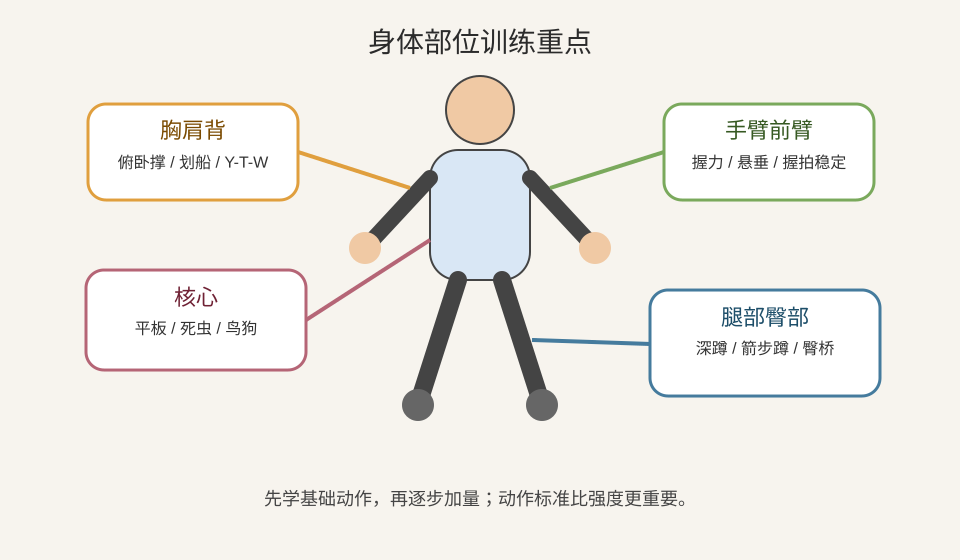
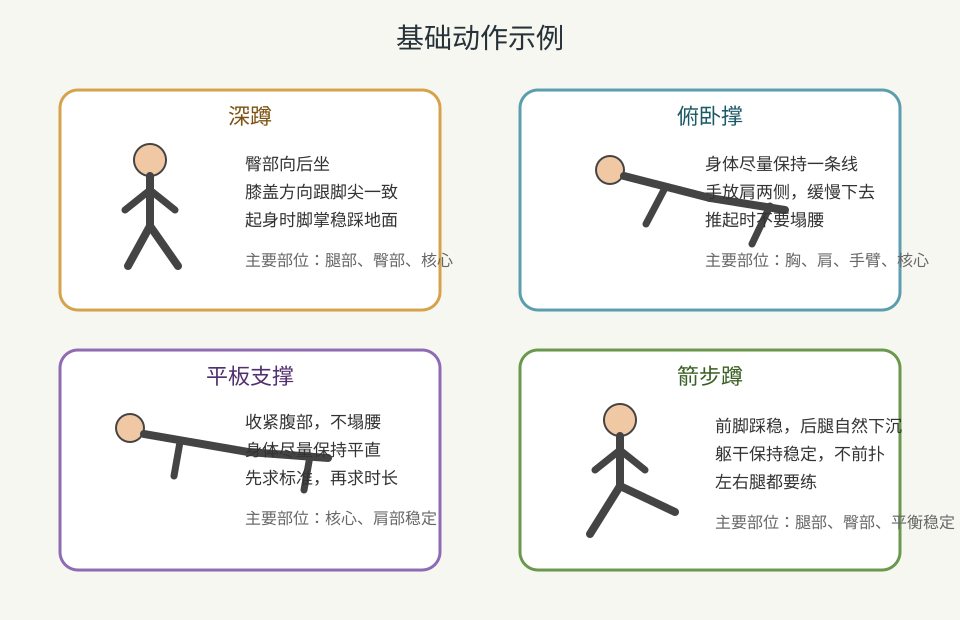
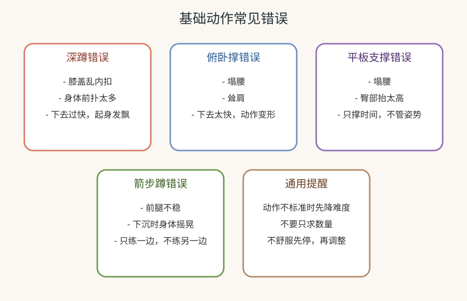
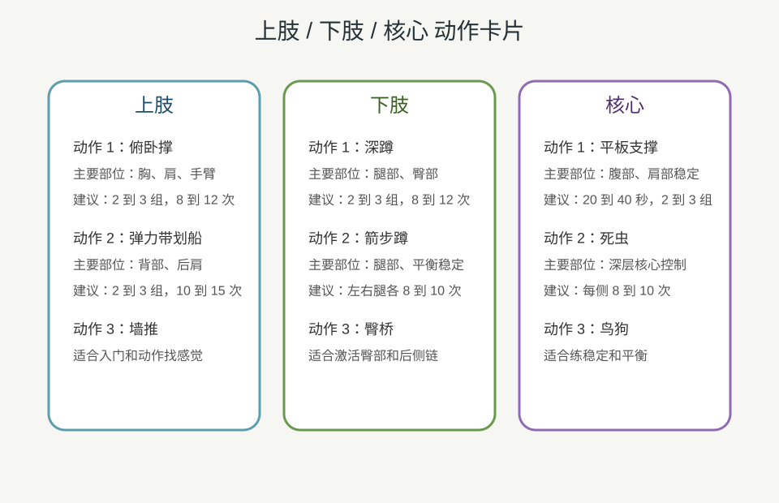
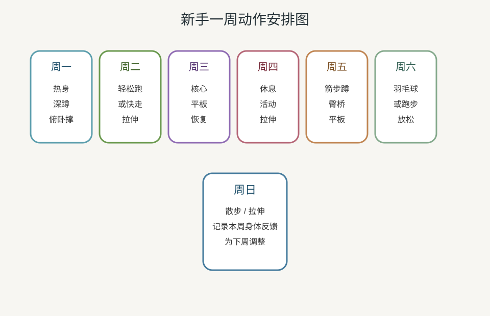

---
title: 锻炼身体基础
date: 2026-03-25 11:40:42
permalink: /study-fitness-basic
categories:
  - 学习
tags:
  - 学习
  - 锻炼
  - 身体
---

# 锻炼身体基础

## 阅读建议

- 这页主要用于建立最基础的身体锻炼认知，不追求健身房体系化训练，重点是知道各部位怎么练、怎么减少受伤、怎么配合饮食。

## 核心目标

- 建立最小锻炼框架：身体部位、基础动作、受伤预防、饮食配合、长期坚持。

## 身体部位训练重点图



## 基础动作示例图



## 基础动作常见错误图



## 上肢下肢核心动作卡片图



## 新手一周动作安排图



## 身体部位怎么理解

| 部位     | 常见锻炼方向               | 为什么重要             |
| -------- | -------------------------- | ---------------------- |
| 胸肩背   | 俯卧撑、划船、肩部稳定练习 | 改善上肢力量与姿态     |
| 腿部臀部 | 深蹲、箭步蹲、跑步基础训练 | 提升下肢力量与稳定性   |
| 核心     | 平板支撑、卷腹、抗旋转练习 | 提升整体稳定和运动控制 |
| 手臂前臂 | 拉、推、握拍相关练习       | 服务日常运动与球类动作 |

## 各部位先练什么

| 部位     | 入门先练什么             | 最小做法                        |
| -------- | ------------------------ | ------------------------------- |
| 胸肩背   | 俯卧撑、墙推、弹力带划船 | 每次 2 到 3 组，每组 8 到 12 次 |
| 腿部臀部 | 深蹲、箭步蹲、臀桥       | 先空手练动作，再慢慢加量        |
| 核心     | 平板支撑、死虫、鸟狗     | 先求稳定，不求撑太久            |
| 前臂手臂 | 握力、悬垂、握拍控制     | 先轻量，避免手腕硬顶            |

## 锻炼身体有哪些基础动作

| 动作     | 主要锻炼部位         | 怎么做                           |
| -------- | -------------------- | -------------------------------- |
| 深蹲     | 腿部、臀部、核心     | 双脚站稳，臀部向后坐，再平稳站起 |
| 俯卧撑   | 胸、肩、手臂、核心   | 身体尽量一条线，慢慢下去再推起   |
| 平板支撑 | 核心、肩部稳定       | 手肘或手掌支撑，腹部收紧，不塌腰 |
| 箭步蹲   | 腿部、臀部、平衡稳定 | 一脚在前一脚在后，下沉后再起身   |
| 臀桥     | 臀部、腿后侧、核心   | 仰卧屈膝，抬髋到身体基本成线     |

## 具体如何做

### 深蹲

1. 双脚与肩差不多宽。
2. 像坐椅子一样把臀部向后坐。
3. 下去后再平稳站起。

### 俯卧撑

1. 手放肩两侧。
2. 身体尽量保持一条线。
3. 下去时慢一点，推起时不要塌腰。

### 平板支撑

1. 先摆好支撑姿势。
2. 腹部收紧，身体尽量平直。
3. 先做短时间标准动作，再慢慢延长。

### 箭步蹲

1. 一脚在前，一脚在后。
2. 下沉时保持身体稳定。
3. 左右腿都做，避免只练一侧。

## 常见错误提醒

| 动作     | 常见错误           | 调整建议             |
| -------- | ------------------ | -------------------- |
| 深蹲     | 膝盖乱扣、前扑太多 | 先放慢动作，先求稳定 |
| 俯卧撑   | 塌腰、耸肩         | 降低难度，缩短组数   |
| 平板支撑 | 塌腰、抬臀太高     | 缩短时长，先保证姿势 |
| 箭步蹲   | 身体摇晃、前脚不稳 | 扶墙练或减小动作幅度 |

## 具体怎么开始

1. 每次训练只选 2 到 3 个动作。
2. 每个动作先做 2 组，确认动作稳定后再增加。
3. 下肢、核心、上肢轮换，避免同一部位连续过量。

## 怎么防止受伤

1. 先热身，再进入正式训练。
2. 动作先求标准，不先追求强度。
3. 不舒服时先停，先判断是不是动作或疲劳问题。
4. 逐步增加量，不要突然加很多。

## 常见受伤预防点

| 场景           | 预防重点                     |
| -------------- | ---------------------------- |
| 跑步           | 鞋、步频、落地方式、循序渐进 |
| 羽毛球         | 热身、脚踝膝盖保护、挥拍控制 |
| 自重训练       | 动作标准、关节稳定、不过量   |
| 长期久坐后运动 | 不要一上来高强度             |

## 饮食怎么配合

| 方向     | 最小原则                   |
| -------- | -------------------------- |
| 日常饮食 | 先保证规律，不暴饮暴食     |
| 蛋白质   | 训练后和日常都要有基本摄入 |
| 碳水     | 运动前后可提供能量         |
| 饮水     | 运动前、中、后都注意补水   |
| 睡眠     | 恢复比额外练一组更重要     |

## 最小示例

```text
热身 10 分钟 -> 正式训练 20 到 40 分钟 -> 拉伸放松 -> 补水和正常吃饭
```

## 学习建议

1. 先建立“长期能坚持”的运动节奏。
2. 先学基础动作和受伤预防，再追求强度。
3. 饮食先从规律和基础蛋白摄入开始，不必一开始搞复杂。

## 最小训练示例

```text
热身 10 分钟
深蹲 2 组
俯卧撑 2 组
平板支撑 2 组
拉伸 5 到 10 分钟
```

## 常见误区

- 一开始就追求高强度、高时长。
- 不热身、不拉伸，靠硬扛。
- 只关注动作，不关注饮食和睡眠恢复。

## 延伸阅读

- 仓库内相关： [跑步](/study-running-basic)、[羽毛球](/study-badminton-basic)

