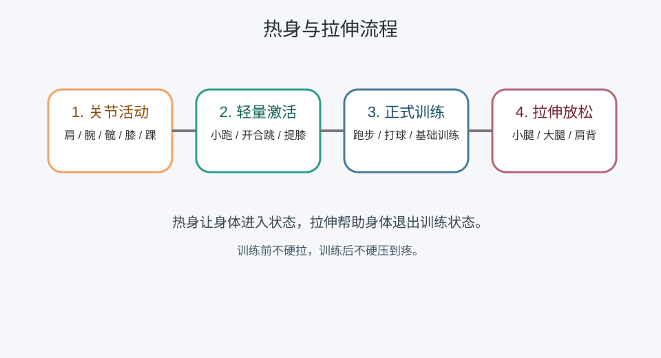

---
title: 热身与拉伸基础
date: 2026-03-25 09:27:03
permalink: /fitness-warmup-stretch-basic
categories:
  - 学习
  - 锻炼
tags:
  - 锻炼
  - 热身
  - 拉伸
---

# 热身与拉伸基础

## 阅读建议

- 这页重点不是动作大全，而是先理解为什么锻炼前要热身、锻炼后要放松拉伸。

## 核心目标

- 建立最小习惯：训练前让身体进入状态，训练后帮助身体恢复，降低受伤风险。

## 热身与拉伸流程图



## 热身和拉伸的区别

| 项目 | 作用                     | 更适合什么时候 |
| ---- | ------------------------ | -------------- |
| 热身 | 提高体温、激活关节和肌肉 | 训练前         |
| 拉伸 | 放松紧张肌群、帮助恢复   | 训练后         |

## 热身重点

1. 先活动关节，再进入轻量动作。
2. 跑步重点放在脚踝、膝盖、髋部。
3. 羽毛球重点放在肩、腕、膝、踝。

## 热身具体怎么做

| 动作类型 | 示例                             | 时间        |
| -------- | -------------------------------- | ----------- |
| 关节活动 | 转肩、转腕、转髋、转踝           | 2 到 3 分钟 |
| 轻量激活 | 高抬腿、小跑、开合跳             | 3 到 5 分钟 |
| 专项预热 | 跑步前小步跑，羽毛球前挥拍和步伐 | 2 到 3 分钟 |

## 拉伸重点

1. 训练后再做静态拉伸更稳妥。
2. 重点照顾当天用得多的部位。
3. 拉伸是放松，不是硬压到疼。

## 拉伸具体怎么做

| 部位       | 示例               | 时间             |
| ---------- | ------------------ | ---------------- |
| 小腿       | 小腿后侧拉伸       | 每侧 20 到 30 秒 |
| 大腿前后侧 | 站姿或坐姿拉伸     | 每侧 20 到 30 秒 |
| 肩背       | 肩部环抱、背部放松 | 每侧 20 到 30 秒 |

## 最小示例

```text
热身 8 到 10 分钟 -> 正式训练 -> 拉伸 5 到 10 分钟
```

## 常见误区

- 不热身直接开始跑或打球。
- 把拉伸做成硬扯、硬压。
- 训练后完全不放松，长期越练越紧。

## 延伸阅读

- 仓库内相关： [锻炼身体基础](/study-fitness-basic)、[跑步](/study-running-basic)、[羽毛球](/study-badminton-basic)

