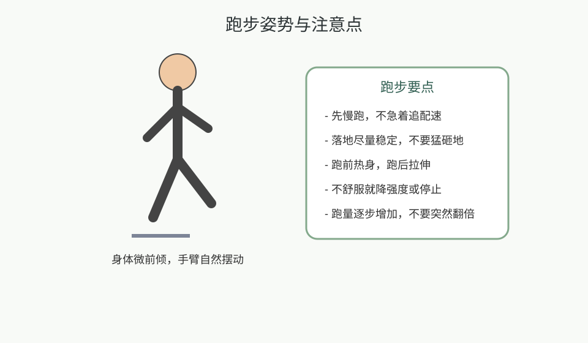
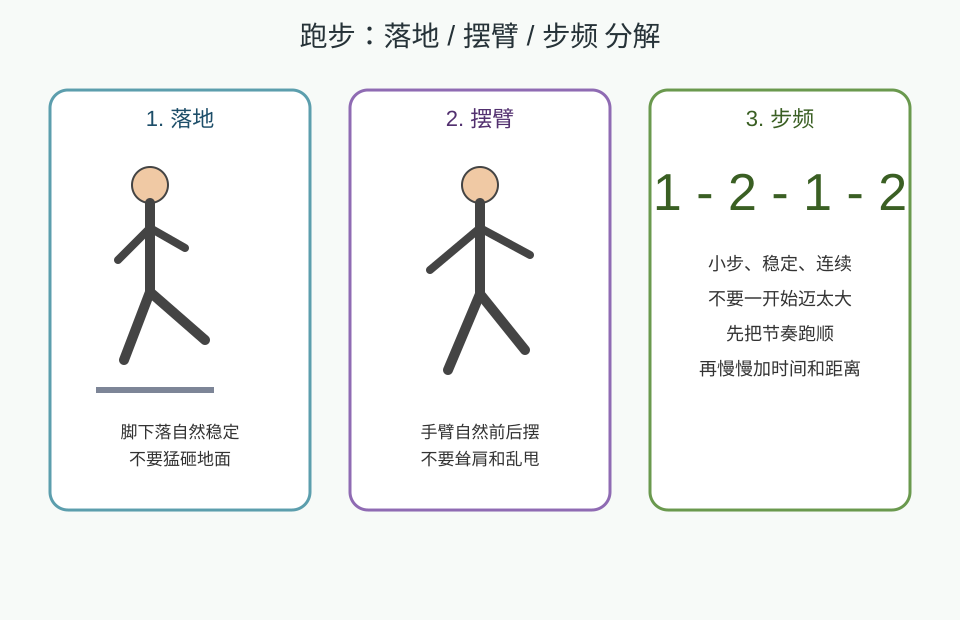

---
title: 跑步
date: 2026-03-25 10:57:41
permalink: /study-running-basic
categories:
  - 学习
tags:
  - 学习
  - 锻炼
  - 跑步
---

# 跑步

## 阅读建议

- 这页以日常锻炼为目标，不讨论专业训练计划，重点是先能安全、稳定地跑起来。

## 核心目标

- 建立跑步入门认知：怎么开始、怎么避免受伤、怎么逐步增加训练量。

## 跑步姿势与注意点图



## 跑步分解图



## 跑步最小主线

```text
热身 -> 慢跑/快走结合 -> 放松拉伸 -> 记录感受
```

## 入门建议

| 方向 | 建议                           |
| ---- | ------------------------------ |
| 节奏 | 先慢，不要一开始就冲速度       |
| 时长 | 先从 15 到 30 分钟建立习惯     |
| 强度 | 能说话但有点喘，是较稳入门强度 |
| 频率 | 每周 2 到 4 次更容易坚持       |

## 具体如何操作

1. 先热身 8 到 10 分钟。
2. 先用慢跑和快走结合，不强迫自己连续跑很久。
3. 跑完后做 5 到 10 分钟放松和拉伸。

## 入门跑法示例

| 阶段    | 做法                                      |
| ------- | ----------------------------------------- |
| 第1阶段 | 慢跑 2 分钟 + 快走 2 分钟，循环 4 到 6 次 |
| 第2阶段 | 慢跑 15 到 20 分钟，跑后快走放松          |
| 第3阶段 | 在不难受的前提下慢慢增加总时长            |

## 新手一周训练示例

| 星期 | 建议安排                       |
| ---- | ------------------------------ |
| 周一 | 休息或轻松散步                 |
| 周二 | 热身 + 慢跑/快走 20 分钟       |
| 周三 | 拉伸或轻量恢复                 |
| 周四 | 热身 + 慢跑 15 到 20 分钟      |
| 周五 | 休息                           |
| 周六 | 轻松跑或快走结合 20 到 30 分钟 |
| 周日 | 拉伸恢复，记录身体反馈         |

## 新手执行建议

- 一周能完成 2 到 3 次已经足够。
- 先跑顺，再考虑增加时间。
- 如果某次跑完很累，下一次就减量。

## 跑步分解操作

### 落地

1. 先求脚下稳定，不猛砸地。
2. 步子不要迈太大。
3. 先让身体适应节奏，再考虑速度。

### 摆臂

1. 手臂自然前后摆动。
2. 不要耸肩，不要左右乱甩。
3. 用摆臂帮助身体维持节奏。

### 步频

1. 先把节奏跑顺。
2. 小步稳定比大步硬冲更适合入门。
3. 先稳定一段时间，再慢慢增加距离或时间。

## 跑步注意点

- 身体略微前倾，不弯腰驼背。
- 步子不要迈太大，先求稳定。
- 手臂自然摆动，不要耸肩。
- 跑后第二天如果非常疲劳，就不要继续硬加量。

## 如何防止受伤

1. 跑前热身，尤其是脚踝、膝盖和髋部。
2. 不要突然把距离和速度拉太高。
3. 鞋不合适、地面过硬、疲劳累积都可能增加受伤概率。

## 常见运动伤与预防

| 常见问题 | 常见原因               | 预防重点                     |
| -------- | ---------------------- | ---------------------------- |
| 膝盖不适 | 量加太快、落地冲击过大 | 循序渐进、控制跑量、注意热身 |
| 小腿紧张 | 热身不足、跑后不放松   | 跑前活动、跑后拉伸           |
| 脚踝不适 | 落地不稳、鞋不合适     | 注意支撑、选择合适跑鞋       |
| 足底不适 | 跑量过猛、恢复不足     | 逐步增加量、安排恢复日       |

## 发现不舒服时怎么做

- 先降强度，不硬顶。
- 先判断是不是疲劳、动作问题或鞋的问题。
- 连续几次都不舒服时，先暂停再观察。

## 最小示例

```text
热身 10 分钟 -> 慢跑 15 分钟 -> 快走 5 分钟 -> 拉伸 5 分钟
```

## 饮食与恢复

- 跑前不要太饱。
- 跑后及时补水，正常进食。
- 睡眠和休息会直接影响第二次跑步状态。

## 常见误区

- 一上来就拼速度或距离。
- 不热身就直接跑。
- 只跑不恢复，腿部越来越紧。

## 延伸阅读

- 仓库内相关： [锻炼身体基础](/study-fitness-basic)、[每周锻炼计划模板](/fitness-weekly-plan-template)

