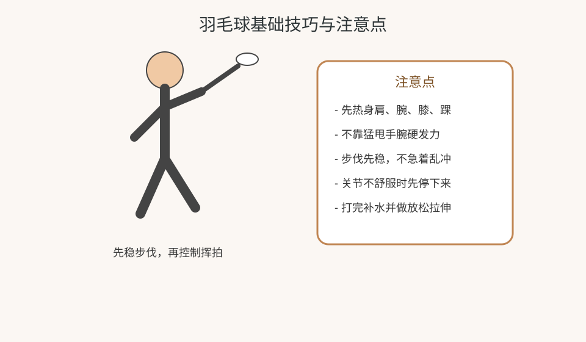
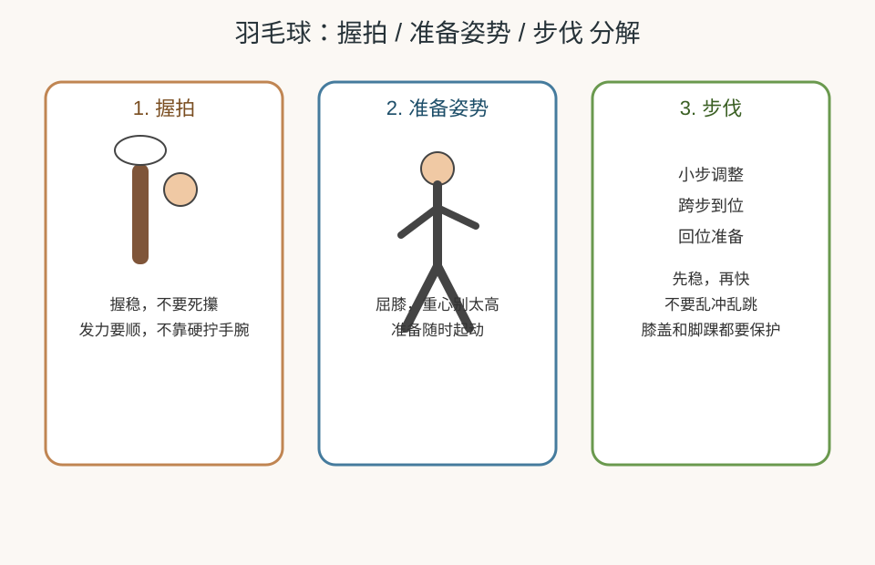

---
title: 羽毛球
date: 2026-03-25 10:57:41
permalink: /study-badminton-basic
categories:
  - 学习
tags:
  - 学习
  - 锻炼
  - 羽毛球
---

# 羽毛球

## 阅读建议

- 这页先解决“怎么打得更安全、更稳定”，不是比赛战术页。

## 核心目标

- 建立羽毛球最基础的锻炼认知：热身、步伐、挥拍控制、关节保护和恢复。

## 羽毛球基础技巧与注意点图



## 羽毛球分解图



## 羽毛球最小主线

```text
热身 -> 步伐和挥拍练习 -> 对打/跑动 -> 放松恢复
```

## 入门重点

| 方向 | 重点                       |
| ---- | -------------------------- |
| 热身 | 手腕、肩、膝盖、脚踝先热开 |
| 步伐 | 先稳，不乱冲               |
| 挥拍 | 动作控制比用蛮力更重要     |
| 节奏 | 初期重基础，不要一直暴冲   |

## 具体如何操作

1. 先热身，再做步伐和挥拍预热。
2. 先练稳定对打，不急着追求杀球。
3. 先打 20 到 40 分钟可控强度，再逐步增加。

## 入门练习示例

| 阶段 | 做法                            |
| ---- | ------------------------------- |
| 热身 | 肩、腕、膝、踝活动 8 到 10 分钟 |
| 基础 | 挥拍练习 + 步伐练习 10 分钟     |
| 对打 | 中低强度对打 20 分钟            |
| 放松 | 拉伸肩、手腕、腿部              |

## 新手一周训练示例

| 星期 | 建议安排                          |
| ---- | --------------------------------- |
| 周一 | 休息或拉伸恢复                    |
| 周二 | 热身 + 步伐/挥拍练习 20 分钟      |
| 周三 | 轻量活动或休息                    |
| 周四 | 热身 + 中低强度对打 30 到 40 分钟 |
| 周五 | 休息                              |
| 周六 | 热身 + 步伐 + 对打 40 分钟左右    |
| 周日 | 拉伸恢复，记录身体反馈            |

## 新手执行建议

- 一周 1 到 2 次打球更稳妥。
- 先练步伐和稳定击球，再谈杀球。
- 感到手腕、肩膀、膝盖紧张时就先降强度。

## 羽毛球分解操作

### 握拍

1. 先握稳，不要死攥。
2. 发力要顺，不要一直硬甩手腕。
3. 初期先求稳定击球。

### 准备姿势

1. 屈膝，重心别太高。
2. 身体保持随时能启动的状态。
3. 打球前先进入准备姿势，不要站得太死。

### 步伐

1. 先小步调整，再跨步到位。
2. 击球后记得回位。
3. 先稳，再快，不急着乱冲。

## 打球注意点

- 先练步伐和稳定击球，再谈发力。
- 不要只顾着杀球，先保证动作顺。
- 打球过程中如果膝盖或脚踝明显不适，要先停下来。
- 手腕紧时不要继续猛甩。

## 如何防止受伤

1. 打前一定热身，特别是肩、腕、膝、踝。
2. 不要靠猛发力弥补动作不熟。
3. 发现膝盖、脚踝不舒服时先停，不硬打。

## 常见运动伤与预防

| 常见问题 | 常见原因                   | 预防重点                     |
| -------- | -------------------------- | ---------------------------- |
| 肩膀不适 | 挥拍发力过猛、动作不稳定   | 先热身、控制动作、不过量     |
| 手腕不适 | 频繁猛甩、击球动作僵硬     | 放松发力、减少硬打           |
| 膝盖不适 | 急停急转过多、下肢力量不足 | 热身、步伐控制、增强下肢稳定 |
| 脚踝不适 | 起动急、落地不稳           | 做好脚踝热身，注意鞋和落地   |

## 发现不舒服时怎么做

- 先停下来，不继续硬打。
- 回看是不是热身不足或动作变形。
- 下次先降低时长和强度，再慢慢恢复。

## 最小示例

```text
热身 10 分钟 -> 步伐 10 分钟 -> 对打 20 分钟 -> 放松拉伸
```

## 饮食与恢复

- 打球前后都要注意补水。
- 打完后适当吃东西帮助恢复。
- 连续高强度打球后要给身体恢复时间。

## 常见误区

- 不热身就直接上场。
- 只想着杀球，不练步伐和稳定性。
- 手腕、肩膀已经不舒服还继续硬打。

## 延伸阅读

- 仓库内相关： [锻炼身体基础](/study-fitness-basic)、[每周锻炼计划模板](/fitness-weekly-plan-template)

