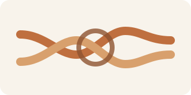
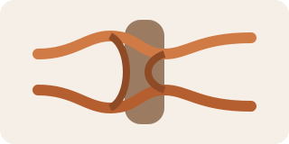

---
title: 绳结基础与常见用途
date: 2026-03-30 14:40:00
permalink: /life-knot-guide
categories:
  - 学习
  - 生活常识
tags:
  - 生活常识
  - 绳结
---

# 绳结基础与常见用途

## 阅读建议

- 这页不追求一次学很多绳结，先记住最常见、最实用、最容易分清用途的几种。
- 图里是示意图，重点先看结构差异，再记“这结一般拿来干什么”。

## 核心目标

- 先建立最小判断：固定、挂接、成圈、临时捆绑分别该优先想到哪类绳结。

## 常见绳结一览

| 绳结   | 图例                                                                  | 主要用途                         | 常见场景                         | 使用要点                               |
| ------ | --------------------------------------------------------------------- | -------------------------------- | -------------------------------- | -------------------------------------- |
| 平结   |            | 连接两端粗细接近的绳子、打包收束 | 捆衣物、扎袋口、临时收纳         | 适合受力较均匀场景，不适合高风险承重   |
| 八字结 |  | 做止结、防止绳头滑脱             | 绳尾防滑、登山训练基础认知       | 结构清楚，较好检查，适合做基础止结     |
| 称人结 |       | 在绳端形成固定圈                 | 临时套挂、固定拉点、救援基础认知 | 成圈后不易越拉越紧，适合做固定圈       |
| 双套结 |        | 快速把绳子固定在杆、树枝、栏杆上 | 晾晒、临时绑杆、固定支点         | 上手快、调整方便，但长期受力要注意松动 |

## 怎么快速选

| 你的目的           | 优先想到 |
| ------------------ | -------- |
| 临时把两端绑在一起 | 平结     |
| 防止绳尾滑出去     | 八字结   |
| 需要一个固定圈     | 称人结   |
| 快速绑在杆状物上   | 双套结   |

## 最小示例

```text
绑杆子 -> 先想双套结
做固定圈 -> 先想称人结
防绳尾滑脱 -> 先想八字结
临时收束打包 -> 先想平结
```

## 注意点

- 生活场景里先分清“临时固定”和“承重安全”是不是一回事，不要混用。
- 涉及高空、救援、攀爬、负重等风险场景时，不能只靠这页图例直接上手。
- 真要长期使用，最好实际拿绳子反复打几次，比单看图更容易记住。

## 延伸阅读

- 仓库内相关： [生活常识](/life-common-sense)、[生活常识简介](/life-common-sense-intro)、[家用五金工具入门](/life-home-tools-basic)
- 外部资料： [Animated Knots](https://www.animatedknots.com/)

