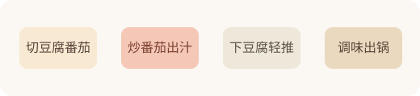

---
title: 番茄豆腐
date: 2026-03-31 10:50:00
permalink: /diet-recipe-tomato-tofu
categories:
  - 学习
  - 饮食
  - 家常菜索引
tags:
  - 饮食
  - 家常菜
  - 豆腐蛋类
---

# 番茄豆腐

## 菜品介绍

- 酸甜清爽、偏轻口，适合想吃热菜又不想太油的时候。

## 适合季节

- 夏、秋

## 主菜分类

- 豆腐蛋类

## 材料（1人份）

### 主料

- [豆腐](/diet-tofu-egg-guide) 250g
- [番茄](/diet-vegetable-ingredient-guide) 180g

### 辅料

- [葱](/diet-seasoning-visual-guide) 8g

### 调料

- [盐](/diet-basic-seasoning-guide) 2g
- [生抽](/diet-basic-seasoning-guide) 4ml
- [白糖](/diet-seasoning-notes) 2g

## 做法

1. 豆腐切块，番茄切块，葱切末。
2. 先把番茄炒软出汁。
3. 下豆腐轻推，加 30ml 水略煮。
4. 用盐、生抽和 2g 白糖调味，出锅前撒葱。

## 关键要点

- 豆腐下锅后轻推，不要大力翻。
- 番茄先出汁，这道菜才更顺口。

## 延伸阅读

- 仓库内相关： [按主菜分类索引](/diet-recipes-by-main-category)、[豆制品与蛋类认知](/diet-tofu-egg-guide)、[蔬菜认知](/diet-vegetable-ingredient-guide)、[厨房计量估算](/diet-kitchen-measurement-guide)

