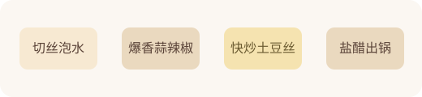

---
title: 土豆丝
date: 2026-03-30 16:10:00
permalink: /diet-recipe-shredded-potato
categories:
  - 学习
  - 饮食
  - 家常菜索引
tags:
  - 饮食
  - 快手菜
  - 素菜
---

# 土豆丝

## 菜品介绍

- 食材简单、成本低，适合练切丝、泡水和快炒节奏。

## 适合季节

- 四季

## 主菜分类

- 素菜

## 材料（1人份）

### 主料

- [土豆](/diet-vegetable-ingredient-guide) 220g

### 辅料

- [青椒](/diet-vegetable-ingredient-guide) 50g
- [蒜](/diet-seasoning-visual-guide) 8g

### 调料

- [盐](/diet-basic-seasoning-guide) 2g
- [醋](/diet-basic-seasoning-guide) 6ml

## 做法

1. 土豆切丝后泡水，去掉部分淀粉。
2. 锅中下油，先炒蒜末和青椒。
3. 下土豆丝快速翻炒。
4. 加盐和 4ml 醋，断生后出锅。

## 关键要点

- 土豆丝别炒太久，保留一点脆感。
- 泡水后要沥干再下锅。

## 延伸阅读

- 仓库内相关： [快手菜索引](/diet-recipes-quick)、[按主菜分类索引](/diet-recipes-by-main-category)、[常用食材图解](/diet-ingredient-visual-guide)、[厨房计量估算](/diet-kitchen-measurement-guide)

