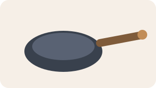
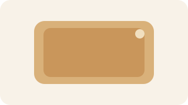
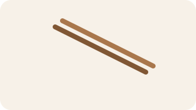

---
title: 常用厨具与餐具图解
date: 2026-03-30 16:40:00
permalink: /diet-cookware-dinnerware-guide
categories:
  - 学习
  - 饮食
  - 做饭基础
tags:
  - 饮食
  - 厨具
  - 餐具
  - 图解
---

# 常用厨具与餐具图解

## 阅读建议

- 这页重点是先把高频物件认清，不要求一次背完所有细分型号。
- 先认外形和用途，再记哪些是做饭用、哪些是装菜吃饭用，会更容易记住。

## 核心厨具

### 炒锅

- 用途：炒、煎、干煸、做多数家常热菜。
- 识别点：锅身深、锅口大、适合翻炒。

### 菜刀

- 用途：切丝、切片、切块、拍蒜。
- 识别点：刀身较宽，适合多数基础切配。

### 砧板

- 用途：放食材切配。
- 识别点：平面大，最好至少两块，生熟分开。

### 锅铲

- 用途：翻炒、铲起食材、压料。
- 识别点：长柄，前端扁平，和锅配套更顺手。

## 辅助器具与餐具

### 汤碗

- 用途：装汤、装面、临时盛放备菜。
- 识别点：碗口较深，适合有汤汁的内容。

### 盘子

- 用途：装炒菜、凉拌菜、熟食成品。
- 识别点：扁平、开口大，适合摆盘和夹取。

### 筷子

- 用途：吃饭、夹菜；公筷和个人筷尽量区分。
- 识别点：细长成对，木筷和耐高温筷用途不同。

## 最小分类法

| 类别     | 典型物件               | 主要任务             |
| -------- | ---------------------- | -------------------- |
| 做饭工具 | 炒锅、菜刀、砧板、锅铲 | 切、炒、装配、出锅   |
| 备菜工具 | 小碗、漏勺、保鲜盒     | 临时分装、沥水、存放 |
| 上桌餐具 | 盘子、汤碗、筷子       | 装菜、盛汤、吃饭     |

## 注意点

- 生食和熟食接触过的工具别不洗就直接混用。
- 切水果、切生肉、切熟食最好不要长期共用一块板。
- 做饭工具看耐热和清洁方便，餐具更看装盛和入口体验。

## 延伸阅读

- 仓库内相关： [厨具与餐具认知](/diet-cookware-dinnerware)、[常用厨具一览](/diet-common-cookware)、[做饭常识与厨房规则](/diet-kitchen-common-sense)

