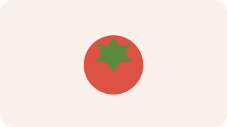
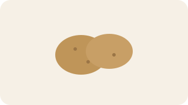

---
title: 常用食材图解
date: 2026-03-30 17:00:00
permalink: /diet-ingredient-visual-guide
categories:
  - 学习
  - 饮食
  - 做饭基础
tags:
  - 饮食
  - 食材
  - 图解
---

# 常用食材图解

## 阅读建议

- 这页重点是先把最常做家常菜时会碰到的主料和配菜认清。
- 学的时候先分成肉蛋豆和蔬菜类，比一股脑记更稳。

## 肉蛋豆类

### 猪肉

- 常见用途：肉丝、肉片、回锅、炖煮。
- 常见搭配：青椒、蒜苗、豆瓣。

### 鸡蛋

- 常见用途：炒、蒸、煮、做汤。
- 常见搭配：番茄、青椒、木耳。

### 豆腐

- 常见用途：烧、煮、炖、麻婆豆腐。
- 常见搭配：豆瓣、肉末、花椒。

## 蔬菜类

### 青椒

- 常见用途：配菜、快炒。
- 常见搭配：肉丝、鸡蛋、豆干。

### 番茄

- 常见用途：炒蛋、煮汤、做汤面。
- 常见搭配：鸡蛋、牛肉、面条。

### 土豆

- 常见用途：炒丝、炖煮、烧菜。
- 常见搭配：青椒、鸡块、牛肉。

## 最小分类法

| 类别 | 典型食材         | 主要特点                 |
| ---- | ---------------- | ------------------------ |
| 主料 | 猪肉、鸡蛋、豆腐 | 决定这道菜主体口感       |
| 配菜 | 青椒、番茄、土豆 | 增加颜色、口感和搭配变化 |

## 注意点

- 肉类和蔬菜切配前后要注意刀板清洁。
- 豆腐、番茄、叶菜这类食材处理时都怕过度翻动或久放。
- 土豆丝、木耳这类食材是否泡水、焯水，会明显影响口感。

## 延伸阅读

- 仓库内相关： [食材认知](/diet-ingredient-knowledge)、[常用食材一览](/diet-common-ingredients)、[备菜与预处理基础](/diet-meal-prep-basic)

